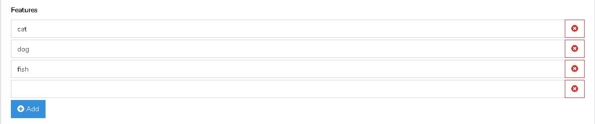

# vue-repeater-field

# Image

# Installation
download or clone this file into your components folder or any folder.

don't forget to specify the import path.

add this code to your app.js

      
    window.fire = new Vue();
    
   This line of code updates child when querying axios response
   
    self.$refs.childUpdate.fields = data here;
    
   This is requirements on updating child
   
    ref="childUpdate"

# Usage

    <template>
  
    

    
      <label for="feature">Features </label>

      <repeater-input :dataValue="featureData" ref="childUpdate" @dataFeature="featureData = $event"></repeater-input>

      <pre>{{ featureData }}</pre>
  
    
 

    </template>

    

# ENJOY
